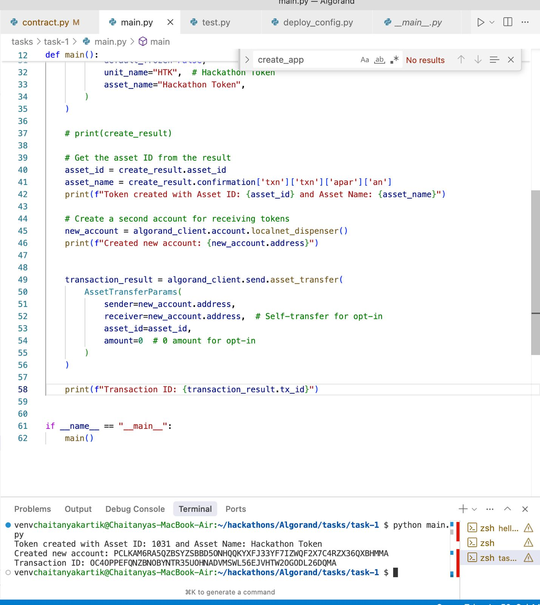
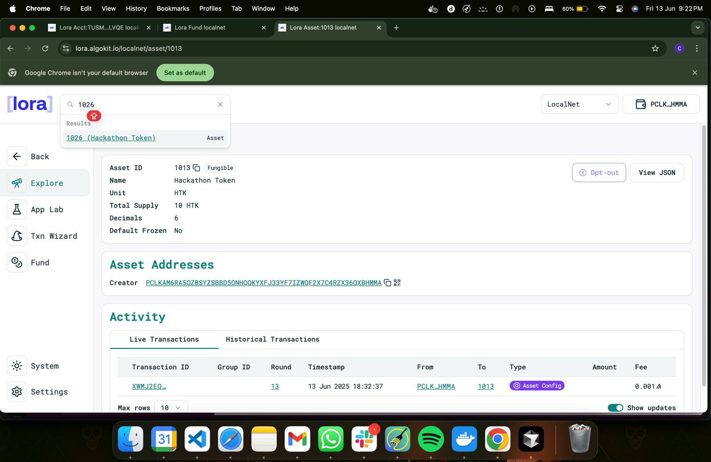

# Algorand ASA Creation and Opt-In Script

This script demonstrates the creation of an Algorand Standard Asset (ASA) and the process of opting into that asset using a newly created account on a local Algorand network. It utilizes the `algokit-utils` library to interact with the Algorand blockchain.

## Functionality

The `main.py` script performs the following actions:

1.  **Initializes Algorand Client:** Connects to a default local Algorand network.
2.  **Gets Dispenser Account:** Retrieves an account from the localnet dispenser to act as the creator and initial signer.
3.  **Sets Default Signer:** Configures the dispenser account as the default signer for subsequent transactions.
4.  **Creates an ASA (Token):**
    *   Sends an asset creation transaction to the network.
    *   The token is defined with:
        *   Total supply: 10,000,000
        *   Decimals: 6
        *   Default frozen state: False
        *   Unit Name: "HTK" (Hackathon Token)
        *   Asset Name: "Hackathon Token"
    *   Prints the Asset ID and Asset Name of the newly created token.
5.  **Creates a Second Account:** Retrieves another account from the localnet dispenser. This account will be used to demonstrate the ASA opt-in process.
6.  **ASA Opt-In:**
    *   The second account sends an asset transfer transaction to itself with an amount of 0 for the created ASA. This is the standard method for an account to opt-in to receive a specific ASA.
    *   Prints the transaction ID of the opt-in transaction.

## Prerequisites

*   Python 3.x installed.
*   `algokit-utils` library installed. You can install it via pip:
    ```bash
    pip install algokit-utils
    ```
*   A local Algorand network (like AlgoKit LocalNet or a sandbox) must be running and accessible. The script uses `AlgorandClient.default_localnet()` which typically connects to `http://localhost:4001` with a token `aaaaaaaaaaaaaaaaaaaaaaaaaaaaaaaaaaaaaaaaaaaaaaaaaaaaaaaaaaaaaaaa`.

## How to Run

1.  Ensure your local Algorand network is running.
2.  Navigate to the directory containing `main.py`.
3.  Run the script from your terminal:
    ```bash
    python main.py
    ```

## Proof of Execution

Below are images showing the script running successfully and the output it produces.

**Image 1: Script Execution Output**

<!-- 
    To display your first image here:
    1. Create a folder named 'images' (or any name you prefer) in the same directory as this [README.md](http://_vscodecontentref_/2) file.
    2. Place your first image file (e.g., `script_output.png`) inside this 'images' folder.
    3. Replace the line below with:  
-->
**(Placeholder for First Image)**



**Image 2: (Optional - e.g., AlgoExplorer Screenshot of Asset or Transaction)**

<!-- 
    To display your second image here:
    1. Place your second image file (e.g., `algoexplorer_proof.png`) inside the same 'images' folder.
    2. Replace the line below with:  
-->
**(Placeholder for Second Image)**



