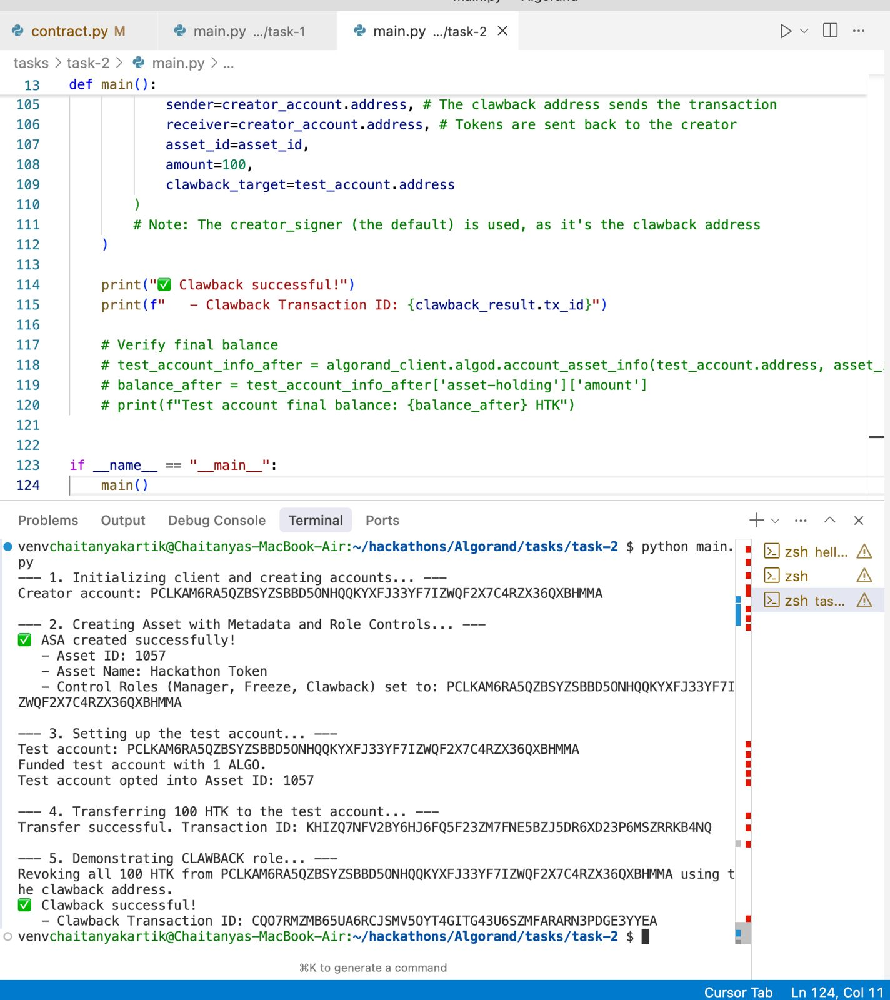
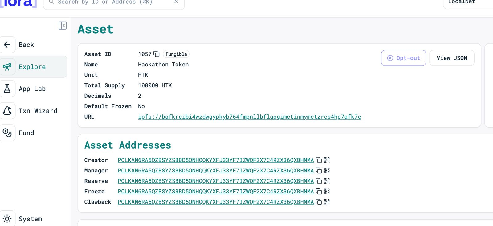

# Algorand ASA Creation and Account Opt-In Script

This Python script demonstrates the creation of an Algorand Standard Asset (ASA) and the process for a newly created account to opt-in to receive this ASA. It uses the `algokit-utils` library to interact with a local Algorand network.

## Functionality

The `main.py` script performs the following steps:

1.  **Initialize Algorand Client:** Connects to the default local Algorand development network.
2.  **Dispenser Account Setup:**
    *   Retrieves an account from the localnet dispenser.
    *   Creates a `SigningAccount` instance using the private key of the dispenser account.
    *   Sets this `SigningAccount` as the default signer for subsequent transactions initiated by the client.
3.  **ASA (Token) Creation:**
    *   Sends an asset creation transaction to the network using the dispenser account as the sender.
    *   The ASA is configured with the following parameters:
        *   **Total Supply:** 10,000,000
        *   **Decimals:** 6
        *   **Default Frozen:** False
        *   **Unit Name:** "HTK" (Hackathon Token)
        *   **Asset Name:** "Hackathon Token"
    *   Retrieves and prints the Asset ID and Asset Name of the newly created token from the transaction confirmation.
4.  **New Account Creation:**
    *   Retrieves a second account from the localnet dispenser.
    *   Prints the address of this newly created account.
5.  **ASA Opt-In by New Account:**
    *   The newly created second account initiates an asset transfer transaction to itself for the created ASA.
    *   The amount of the transfer is 0, which is the standard procedure for an account to opt-in to an ASA.
    *   Prints the transaction ID of the successful opt-in transaction.

## Prerequisites

*   Python 3.x installed.
*   `algokit-utils` library installed. If not, install it using pip:
    ```bash
    pip install algokit-utils
    ```
*   A local Algorand network (e.g., AlgoKit LocalNet) must be running. The script uses `AlgorandClient.default_localnet()`, which typically targets `http://localhost:4001` for the Algod API and uses the default KMD token.

## How to Run

1.  Ensure your local Algorand network is active and accessible.
2.  Navigate to the directory containing the `main.py` script (`/Users/chaitanyakartik/hackathons/Algorand/tasks/task-1/`).
3.  Execute the script from your terminal:
    ```bash
    python main.py
    ```
    (Assuming the [main.py](http://_vscodecontentref_/0) file is in the same directory as this README, which is [task-2](http://_vscodecontentref_/1). If [main.py](http://_vscodecontentref_/2) is in `task-1` as per its filepath, adjust the run instructions or file location accordingly.)

## Proof of Execution

Below are placeholders for images demonstrating the script's successful execution and output.

**Image 1: Script Execution Output (Showing Asset ID, New Account, and Opt-In TxID)**

<!--
    To display your first image here:
    1. Create a folder named 'images' (or any name you prefer) in this directory (/Users/chaitanyakartik/hackathons/Algorand/tasks/task-2/).
    2. Place your first image file (e.g., `script_run_output.png`) inside this 'images' folder.
    3. Replace the line below with: 
-->
**(Placeholder for First Image: Script Output)**



**Image 2: (Optional - e.g., AlgoExplorer Screenshot showing the new account opted into the HTK asset)**

<!--
    To display your second image here:
    1. Place your second image file (e.g., `algoexplorer_opt_in.png`) inside the same 'images' folder.
    2. Replace the line below with: 
-->
**(Placeholder for Second Image: ASA Opt-In Proof)**



---
